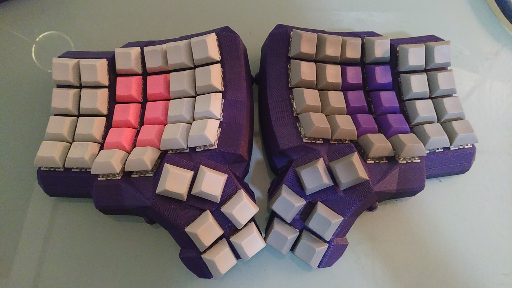
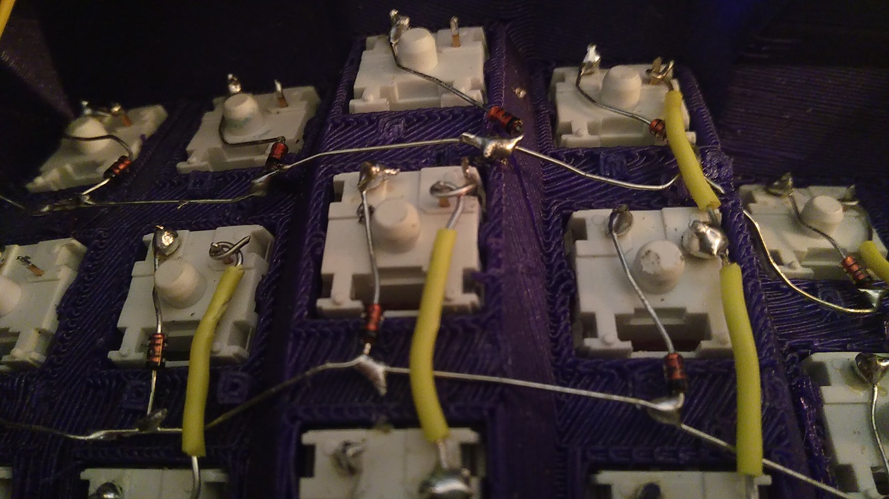

# Dactyl-Manuform-Build-Log
Here is some documentation notes about the Dactyl Manuform keyboard I built. More details to come!

### Issues encountered:

1) The wiring diagram provided for the 3-wire serial connection between the arduinos is INCORRECT. What you are supposed to do, is you the same pins, but use the SAME WIRE on the same pin for each. The wiring diagram given swaps some wires, and it does not work.

2) The RJ-9 connection DOES NOT WORK. I have seen many issues on reddit, complaining about the serial connection not working. I believe this is partly related to the incorrect wiring diagram, but also do to the RJ-9 being insufficient for some reason. Upon replacing the whole RJ-9 setup with direct wiring, the serial connection functioned properly.

3) There is no mounting for the arduino. It hangs inside. I have done some cable management techniques to (knots of sorts) to prevent connectors being ripped out. I also sandwiched a piece of paper under the arduino to prevent electrical shorts with the wiring (as it rests directly upon it).

4) There is no mounting for the micro-USB connection. This is a huge issue, as I have already broken 4 arduinos from the micro-usb snapping off. I had to buy a microusb extender, that has screw holes that I can mount on the case, to prevent this. I had to drill + dremel this out, however it works great.

5) No mounting for a reset button. Everytime you flash this keyboard, you need to short two pins on the arduino. Without an external button to do this, I have to dissasemble the bottom plate to short this. This can get annoying if you are changing your layout often.

### Picture of the keyboard:

### Wiring:

### Purchases:

#### Wires:
https://www.ebay.com/itm/40PC-Dupont-20CM-Male-To-Female-Jumper-Wire-Ribbon-Cable-F-Arduino-Breadboard-AA/112403384085?ssPageName=STRK%3AMEBIDX%3AIT
https://www.ebay.com/itm/Micro-USB-2-0-Male-to-Female-connector-Adapter-Cable-30cm-With-Panel-Mount-Hole/391957934957?ssPageName=STRK%3AMEBIDX%3AIT&_trksid=p2057872.m2749.l2649

#### 4 more arduinos
https://www.ebay.com/itm/1pcs-Pro-Micro-ATmega32U4-5V-16MHz-Replace-ATmega328-Arduino-Pro-Mini/183739584199?ssPageName=STRK%3AMEBIDX%3AIT&_trksid=p2057872.m2749.l2649

#### first set of arduinos (I broke the connectors off on all 4)
https://www.ebay.com/itm/Pro-Micro-ATmega32U4-5V-16MHz-Replace-ATmega328-Arduino-Pro-Mini-LA/392189223872?ssPageName=STRK%3AMEBIDX%3AIT&_trksid=p2057872.m2749.l2649

https://www.ebay.com/itm/Qty-50-M3-3mm-M3-0-5-Brass-Threaded-Metal-Heat-Set-Screw-Inserts-for-3D-Printing/292174792941?ssPageName=STRK%3AMEBIDX%3AIT&_trksid=p2057872.m2749.l2649

https://www.ebay.com/itm/100-M3-0-5x5mm-OR-M3X5-mm-Socket-Allen-Head-Cap-Screw-Stainless-Steel/150975655413?ssPageName=STRK%3AMEBIDX%3AIT&_trksid=p2057872.m2749.l2649

$2.57: 10 Female Micro USB to DIP Adapter Converter 2.54mm PCB Breakout Board DIY

$1.96 (2): 9.3" Black RJ9 Telephone Phone Modem Coil Line Cord Cable
Diodes:

$8.55 (3): 100 x 1N4148 Diodes DO-35 Switching Signal 4148 - USA SELLER - Free Shipping

#### keycaps:
https://www.aliexpress.com/item/32904396891.html
 $ 17.48 X1: Purple Pink 
 $ 17.48: Grey White
